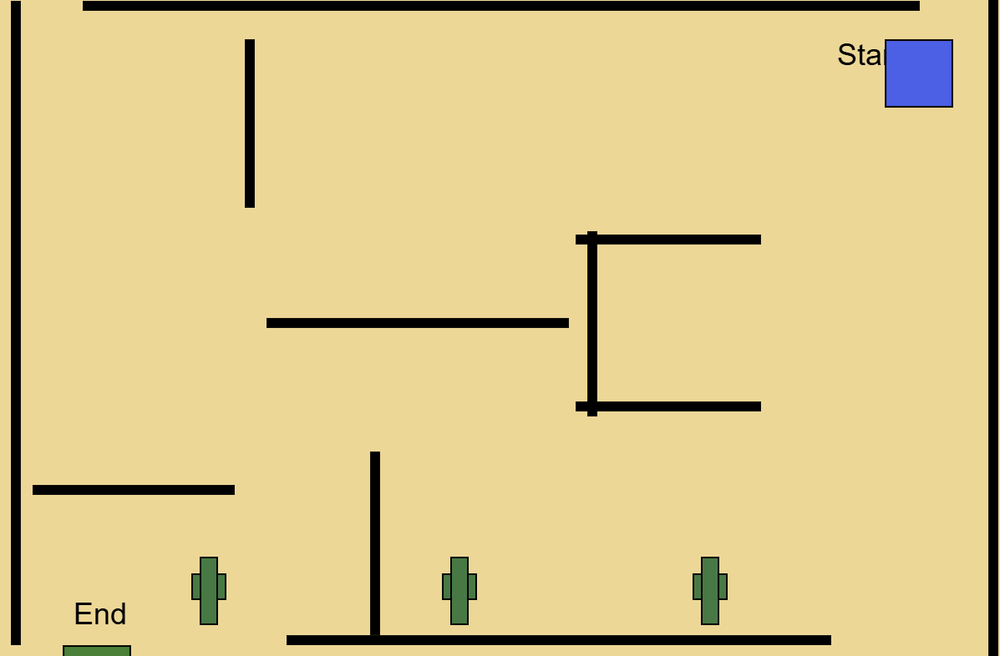

[](https://award.athena.hackclub.com?utm_source=readme)
# 🧩 Maze Adventure Game

This is a 2-level interactive **maze adventure game** built using **p5.js** and **p5.play**. Players navigate through themed mazes using arrow keys and progress by reaching the "End" zone.

---

## 🎮 How to Play

* Press the **Start Game** button to begin.
* Use **arrow keys** to move your character (⬅️ ⬆️ ➡️ ⬇️).
* Navigate from **Start** to **End** without being trapped by the walls.
* Win **Level 1 (Grassland)** to unlock **Level 2 (Sandland)**.
* Complete all levels to see a **"Play Again"** option.

---

## 🌟 Features

* Two uniquely styled maze levels:

  * 🌿 **Grassland**
  * 🏜️ **Sandland**
* Responsive movement using `kb.pressing()` (p5.play)
* Walls created dynamically using `Sprite` groups
* Themed background decorations for immersive gameplay
* Interactive buttons: `Start Game`, `Next Level`, and `Play Again`

---

## 📁 File Structure

```
maze-adventure/
├── script.js       # Main game logic
├── README.md       # This file
```

---

## 🔧 Technologies Used

* [p5.js](https://p5js.org/) – creative coding framework
* [p5.play](https://molleindustria.github.io/p5.play/) – sprite support for p5.js

---

## 🚀 Getting Started

1. Open the code in the [p5.js Web Editor](https://editor.p5js.org/).
2. Make sure **p5.play** is included as an external library (via Settings → Libraries).
3. Click the **Play ▶** button to run the game.
4. Click **Start Game** and begin exploring!

---

## 🧠 Learning Highlights

This project demonstrates:

* Game loops and sprite interaction in p5.js
* Conditional level logic with state variables
* Dynamic wall creation using groups
* The use of custom UI buttons in canvas-based games

---

## 📸 Screenshot


